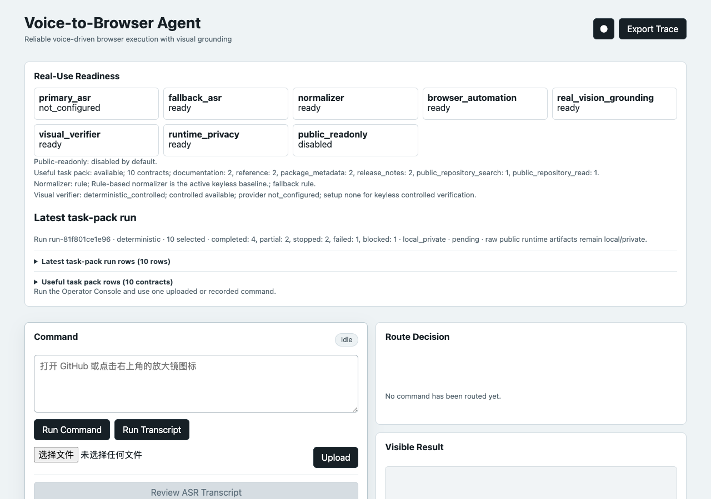

# Voice-to-Browser Agent

Standalone bounded Chinese-first Voice-to-Browser Agent demo. It accepts one uploaded or recorded spoken command, transcribes it, normalizes it into a structured browser task or clarification request, applies deterministic safety gates, runs bounded browser execution with visual grounding, and writes sanitized traces for review.

This is a scoped demo application project, not a `browser-use-vision` voice extension, public ranking claim, or broad autonomous assistant.

## Project Status

Status: final local MVP complete, with the 2026-05-30 closeout archived in `openspec/changes/archive/2026-05-30-final-project-completion-audit/`, the 2026-06-01 reliability gate archived in `openspec/changes/archive/2026-06-01-ci-backed-reliability-evidence-gate/`, and the 2026-06-01 Operator Console UI polish archived in `openspec/changes/archive/2026-06-01-polish-operator-console-ui/`.

Closeout validation:

- `.github/workflows/front-door.yml`: public README/license/JSON/compile checks.
- `.github/workflows/reliability.yml`: OpenSpec strict validation plus the CI-safe pytest subset.
- Local full-suite command: re-run `uv run pytest` from this directory when local dependencies are available.
- Repo hygiene command: re-run `git diff --check`.

The repository is intended as a bounded, reviewer-friendly local demo and evidence pack. It does not include fine-tuning, checkpoint publication, ASR/TTS quality evaluation, public leaderboard ranking, production readiness, or broad public-web autonomy.

## Quickstart

```bash
uv sync --extra dev
uv run uvicorn voice_browser_agent.app:app --reload
```

Open `http://127.0.0.1:8000`, upload a supported audio file, or paste one of the fixture transcripts from `fixtures/audio/*.fixture.json`.

The local visual grounding dependency is resolved by `uv` from `../../../browser-use-vision` through `[tool.uv.sources]`. If the repo lives elsewhere, edit that path or install `browser-use-vision` into the environment before running non-demo vision checks. Reliability CI does not rely on that sibling checkout; it installs this package without dependency resolution and runs a documented CI-safe pytest subset.

Check real-use readiness before running uploaded or recorded audio:

```bash
uv run python scripts/preflight_real_use.py
```

The preflight reports primary ASR, fallback ASR, Playwright browser automation, real `browser-use-vision` grounding, visual verifier readiness, and runtime privacy status without exposing local runtime paths.

## CI and Local Evidence Boundary

GitHub Actions has two separate gates:

- `.github/workflows/front-door.yml` checks the public front door: README links,
  license text, committed JSON parseability, and Python compilation.
- `.github/workflows/reliability.yml` checks the reliability contract:
  `OPENSPEC_TELEMETRY=0 openspec validate --all --strict`, an explicit
  dependency install that avoids the missing local `browser-use-vision` sibling,
  and a CI-safe pytest subset for docs, schemas, deterministic evidence
  builders, privacy guards, and release-pack contracts.

The CI-safe pytest subset is not live public browsing, not recorded-audio, not real-provider inference, and not model training. Browser/runtime-heavy checks,
real audio review, optional provider trials, live public-readonly runs, and full
`uv run pytest` remain local/private validation paths unless a later change makes
them deterministic and CI-safe.

Build the generated reliability snapshot locally:

```bash
uv run python scripts/build_reliability_snapshot.py
```

The command writes `runtime/reliability-snapshot/manifest.json`. That manifest
summarizes committed sanitized traces plus optional local/private manifests; it
records unavailable optional inputs as unavailable instead of fabricating
metrics, and the generated `runtime/` output stays ignored.

## Runtime

- The Operator Console and browser execution run locally.
- `browser-use-vision` is imported as a dependency and remains the Visual Grounding Engine.
- Heavy ASR or visual inference can be configured through optional remote service URLs in `.env`.
- Raw recordings, private traces, live browser screenshots, credentials, checkpoints, and remote host details stay out of version control.
- JSON fixture manifests are replayed through `/api/fixtures/{fixture_id}/executions`; they are not raw audio uploads.
- `VOICE_BROWSER_DEMO_DRY_RUN=true` records an explicit stopped preview trace. Disable it only when a real browser-use/browser-use-vision executor backend is configured.
- `VOICE_BROWSER_NORMALIZER_PROVIDER=rule` keeps the default keyless deterministic normalizer. Use `mock_llm` for offline structured-output parsing evidence, or configure `openai_compatible` / `generic_http` with `VOICE_BROWSER_NORMALIZER_ENDPOINT_URL` for local private provider trials. Every LLM-style output still passes schema parsing, the deterministic validator, confirmation gates, route policy, and sanitized trace export.
- Normalizer provenance is recorded as safe metadata: provider mode, output source, prompt/schema version, schema status, output kind, and fallback reason. API keys, request headers, raw prompts, and raw provider responses are excluded from exports and release handoff artifacts.
- Visual verification loop evidence is keyless deterministic by default for controlled local pages. Each agentic step separates action status from the visual verification result, including outcome, expected condition, observed state summary, reason, proof refs, and recovery or stop decision. Real VLM/provider verification is optional and local/private; raw screenshots, raw annotated images, raw prompts, provider responses, credentials, local paths, and remote host details are not release evidence.
- `VOICE_BROWSER_PUBLIC_READONLY_ENABLED=false` keeps `live_public_readonly` disabled by default. When enabled, it only runs allowlisted public read-only targets in a fresh local browser context, with short step/time budgets, No login, no file transfer, and private-by-default traces until sanitizer approval. A task-contract and completion verifier must match before a public task is reported as complete.
- The public-readonly reliability matrix summarizes the 5-task smoke set across completed, partial, stopped, failed, and blocked outcomes. It is bounded local read-only evidence with private-by-default artifacts, not a production-use, broad-autonomy, barrier-bypass, account-workflow, ranking, model-quality, or raw-public-data claim.
- The public-readonly useful task pack expands that summary into 8-12 stable read-only task contracts for documentation, reference, package metadata, release notes, and public repository search/read. It remains a local/private summary, not deployed web operation, leaderboard-style ranking, broad autonomy, captcha bypass, account automation, or a raw public artifact release.
- The public-readonly live task-pack runner can write a local/private run manifest for selected useful tasks or the full pack. Deterministic mode validates the same contract without touching the network; live mode remains opt-in and records completed, partial, stopped, failed, or blocked outcomes honestly.
- Trace-derived training examples can be created from sanitized Execution Traces for later Speech-to-Task Adaptation. This is not a fine-tuning pipeline or model result claim.

### Visible Real GitHub Public-Readonly Smoke

Real GitHub execution is opt-in and stays local/private. Use one allowlist entry with two GitHub task contracts, then run the console and type `Search GitHub repositories for agent tooling, do not log in` or `Read the README for microsoft/playwright on GitHub`.

```bash
export VOICE_BROWSER_PUBLIC_READONLY_ENABLED=true
export VOICE_BROWSER_PUBLIC_READONLY_ALLOWLIST='github|GitHub|https://github.com/|github,repo,repositories|[{"task_id":"github-repo-search","task_kind":"github-repo-search","target_url_template":"https://github.com/search?q={search_query}&type=repositories","allowed_actions":["navigate","search","extract"],"slots":["target_site_hint","search_query"],"completion_criteria":{"criteria_id":"github-repo-search-results","required_proof":["searched_query","search_page_state","repository_result_marker"],"visible_markers":["Repositories","{search_query}"],"url_path_contains":"/search","title_contains":"Search"},"max_steps":3,"timeout_seconds":15,"privacy_policy":"local_private"},{"task_id":"github-public-repo-read","task_kind":"github-public-repo-read","target_url_template":"https://github.com/{owner}/{repo}","allowed_actions":["navigate","extract"],"slots":["target_site_hint","owner","repo"],"completion_criteria":{"criteria_id":"github-public-repo-page","required_proof":["repo_slug","repo_page_title","readme_or_description_marker"],"visible_markers":["README","{repo}","{owner}"]},"max_steps":2,"timeout_seconds":15,"privacy_policy":"local_private"}]'
uv run uvicorn voice_browser_agent.app:app --reload
```

The console's Visible Result panel shows the final real-page screenshot and step screenshots from `runtime/artifacts/public-readonly/`. These screenshots, raw page traces, cookies, browser profiles, and local paths are not public release-pack evidence unless a sanitizer pass explicitly approves them. If GitHub shows captcha, verification, login, rate-limit, permission, or network boundaries, the run is reported as stopped, failed, blocked, or incomplete rather than successful.

### Public-Readonly Task-Pack Runner

Build a deterministic local/private run manifest for the useful task pack without opening public network pages:

```bash
uv run python scripts/run_public_readonly_task_pack.py --all --mode deterministic
```

The command writes `runtime/public-readonly-task-pack/runs/<run_id>/manifest.json`. Use `--task-id <id>` to run a selected subset. Live mode uses the same explicit task contracts and public-readonly safety boundary, remains disabled unless public-readonly configuration is enabled, and keeps raw traces, screenshots, browser state, and local paths out of public evidence unless sanitizer approval is explicit.

## Demo Evidence

- Demo tasks: `docs/demo/demo-task-suite.md`
- Useful local scenarios: `docs/demo/useful-scenarios.md`
- Ablations: `docs/demo/ablations.md`
- Video plan: `docs/demo/video-plan.md`
- Closeout checklist: `docs/demo/closeout-checklist.md`
- Interview overview: `docs/interview-project-overview.html`
- Public evidence page: `docs/public-evidence/index.html`
- Sanitized trace artifacts: `fixtures/traces/sanitized/`
- Live controlled trace artifacts: `fixtures/traces/live-sanitized/`
- Agentic live controlled trace artifacts: `fixtures/traces/agentic-sanitized/`
- Real browser-use-vision controlled trace artifacts: `fixtures/traces/real-vision-sanitized/`
- Real voice controlled trace artifacts: `fixtures/traces/real-voice-sanitized/`
- Real-use failure and operator-decision traces: `fixtures/traces/real-use-sanitized/`

The public artifacts show bounded spoken-command execution, explicit safety stops, visual verification loop evidence, and traceable evidence. Demo-preview traces are separate from live controlled and agentic live controlled traces. They do not claim broad web autonomy.

Refresh the committed real-vision controlled trace when the local Playwright browser and editable `browser-use-vision` dependency are available:

```bash
uv run python scripts/generate_real_vision_trace.py
```

Refresh the committed real voice controlled smoke trace after running a local audio flow:

```bash
uv run python scripts/generate_real_voice_trace.py
```

Build the reviewer release pack from the committed evidence sources:

```bash
uv run python scripts/build_demo_evidence_pack.py
```

The command writes a generated local artifact under `runtime/demo-evidence-release-pack/`. Open `runtime/demo-evidence-release-pack/index.html` for the browser-readable evidence index, or inspect `runtime/demo-evidence-release-pack/manifest.json` for the machine-readable manifest. The generated directory stays local; the committed evidence sources remain `fixtures/traces/sanitized/`, `fixtures/traces/live-sanitized/`, `fixtures/traces/agentic-sanitized/`, `fixtures/traces/real-vision-sanitized/`, `fixtures/traces/real-voice-sanitized/`, and `fixtures/traces/real-use-sanitized/`.

The release pack summarizes visual verification outcomes, verified fixture ids, recovery count, failed or uncertain reasons, source trace paths, and privacy-scan status without asking reviewers to inspect raw trace JSON first. It rejects missing verification evidence and private visual/provider artifacts before presenting the pack as sanitizer-passed.

Build local normalizer comparison evidence from committed fixture transcripts and reviewed seed examples:

```bash
uv run python scripts/build_normalizer_comparison.py --seed-set
uv run python scripts/build_demo_evidence_pack.py --normalizer-comparison-path runtime/normalizer-comparison/manifest.json
```

The comparison manifest stays under `runtime/normalizer-comparison/`. It compares rule and deterministic mock LLM structured-output behavior, records schema status, validator outcome, route readiness, fallback counts, and privacy-scan status, and is local evidence of bounded intent parsing rather than model training, model score, ranking, or broad autonomy.

Build the local Speech-to-Task adaptation preparation dataset from the same committed trace sources:

```bash
uv run python scripts/build_speech_to_task_dataset.py
uv run python scripts/build_speech_to_task_dataset.py --seed-set --evaluation-splits
```

The command writes `runtime/speech-to-task-adaptation-dataset/manifest.json` and `runtime/speech-to-task-adaptation-dataset/examples.jsonl`. Use `--correction-overlay path/to/corrections.json` for reviewed target corrections; the original trace-derived target stays in the generated example. Use `--seed-set` to produce the 20-50 example local seed set from trace-derived examples plus `fixtures/seed-set/reviewed-variants.json`. See `docs/demo/speech-to-task-dataset.md` for the overlay format and inspection path. This dataset is local Speech-to-Task adaptation preparation evidence, not a model result or broad autonomy claim.

Run the local Speech-to-Task adaptation evaluation harness over the held-out split:

```bash
uv run python scripts/build_speech_to_task_eval.py \
  --dataset-manifest runtime/speech-to-task-adaptation-dataset/manifest.json
```

By default the harness evaluates the `test` split with the built-in `rule` and deterministic `mock_llm` candidate modes. It writes `runtime/speech-to-task-adaptation-eval/manifest.json` and `summary.json` with schema-valid rate, output-kind accuracy, intent-type accuracy, required-slot match rate, safety or clarification decision accuracy, route-ready rate, fallback rate, row counts, and failure slices. Future local model or provider outputs can be compared without training by passing strict example-id-matched JSONL:

```bash
uv run python scripts/build_speech_to_task_eval.py \
  --candidate-output-jsonl adapted_model=runtime/local-adapter-candidates.jsonl
```

Include the sanitized comparison and evaluation summaries in the reviewer release pack only when the local manifests exist:

```bash
uv run python scripts/build_demo_evidence_pack.py \
  --normalizer-comparison-path runtime/normalizer-comparison/manifest.json \
  --adaptation-eval-path runtime/speech-to-task-adaptation-eval/manifest.json
```

This is local adaptation-readiness evidence for structured Speech-to-Task behavior. It is not fine-tuning, not checkpoint publication, not ASR/TTS evaluation, not public leaderboard ranking, not state-of-the-art evidence, not production readiness, and not broad public-web autonomy.

## Operator Console Demo Flow

Use the console as a command-first operator workflow. The current layout keeps
real-use readiness, command input, audio transcript review, route decision,
visible result, execution evidence, timeline, export/privacy state, and raw trace
inspection in that order so reviewers can understand a run without opening JSON
first.



- Primary command: type a short spoken-command transcript and run it. The backend selects a route, shows whether it is controlled live or preview-only, and records the route decision in the trace.
- Reviewed audio: upload or record one command, review the ASR transcript, edit it if needed, then run the same route-aware execution path while preserving ASR provenance.
- Normalizer provenance: the summary and route cards show rule, mock LLM, real provider, fallback source, schema status, validator decision, confirmation state, and clarification or blocked reasons without exposing provider-private data.
- Controlled showcase: GitHub-shaped commands route to a local controlled code-search page unless real GitHub public-readonly is explicitly enabled with a matching task contract.
- Real public-readonly: when enabled, supported docs, reference, package metadata, release notes, and GitHub search/read commands show the real-page visual result or block state in the console while artifacts remain local/private.
- Visual verification: agentic runs show passed, failed, or uncertain visual verification; expected condition; observed state; proof refs; recovery; and stop reason before raw JSON. Failed or uncertain verification is not styled as successful.
- Latest task-pack run: readiness and the console can show the most recent local/private task-pack runner manifest, including runner mode, selected task count, outcome counts, sanitizer state, and row-level proof without exposing raw public runtime artifacts.
- Advanced replay: fixture selection, execution-mode override, raw trace JSON, and sanitized export remain available for reproducibility and debugging.

Use `demo_preview` for public showcase tasks unless they have an explicit controlled local route. Use `live_controlled` only for configured controlled pages, such as icon search, color swatch, SVG dashboard, and the controlled GitHub-like showcase. Use `live_public_readonly` only for allowlisted public documentation, reference, package metadata, release notes, or GitHub public repository search/read tasks where every action is read-only and local/private evidence remains private-by-default until sanitizer approval. This is a bounded public-readonly lane, not a broad public-web autonomy claim. Clarification examples should stop before browser execution, confirmation examples should show the operator prompt before continuing, and exported traces must remain sanitized. The UI polish is documented in `../docs/human-briefs/2026-06-01-polish-operator-console-ui.html`; it improves presentation and reviewability without changing ASR, normalizer, route selection, browser execution, trace schema, sanitizer, or public-readonly policy.
